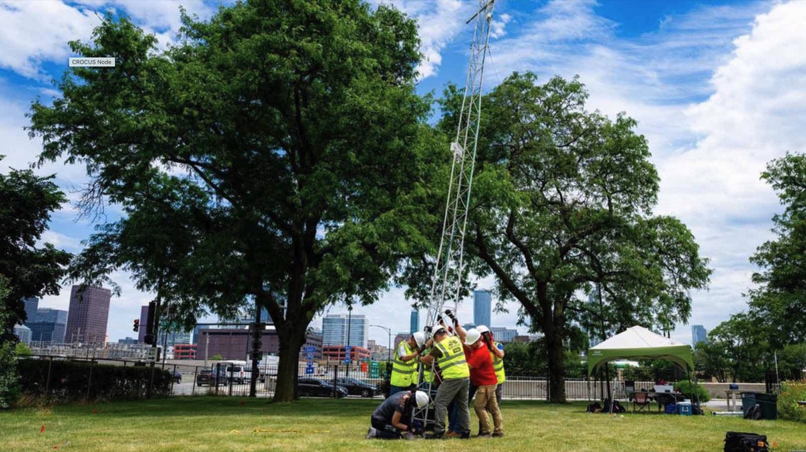

# Engagement

Steve Nesbitt's engagement work spans education and outreach embedded in international field campaigns, co-design with Chicago community groups around the CROCUS urban climate initiative, and public-facing science communication. This page collects those activities and provides a contact path for engagement requests.

---

## Outreach in Field Campaigns

RELAMPAGO-CACTI (2018–2019) was the largest international field campaign ever conducted in subtropical South America, deploying more than 100 scientists across seven agencies in the lee of the Andes in Argentina. Education and outreach were core campaign objectives from day one.

Watch the NCAR video series about RELAMPAGO. <!-- TODO: link to NCAR video page -->

During the campaign we held an **open house and school events that drew thousands of students and families** in Córdoba and Mendoza Provinces, bringing storm chasers, mobile radars, and weather balloons directly into Argentine communities. The campaign's education program and inclusion efforts are described in detail in:

- Nesbitt, S. W., P. V. Salio, and others, 2021: A storm safari in Argentina, Proyecto RELAMPAGO. *Bulletin of the American Meteorological Society*. [doi:10.1175/BAMS-D-20-0029.1](https://doi.org/10.1175/BAMS-D-20-0029.1)
- Rasmussen, K. R., M. A. Burt, A. Rowe, and others, 2021: Enlightenment strikes! Broadening graduate school training through field campaign participation. *Bulletin of the American Meteorological Society*. [doi:10.1175/BAMS-D-20-0062.1](https://doi.org/10.1175/BAMS-D-20-0062.1)
- Fisher, E. V., B. Bloodhart, K. Rasmussen, and others, 2021: Leveraging field-campaign networks to identify sexual harassment in atmospheric science — a study informing safe and inclusive field campaigns. *Bulletin of the American Meteorological Society*. [doi:10.1175/BAMS-D-19-0341.1](https://doi.org/10.1175/BAMS-D-19-0341.1)

### K–12 school visits in Illinois

Classroom visits, weather demonstrations, and career-day talks at:

- Polaris Charter Academy, Chicago
- Champaign, Urbana, and Mahomet public schools

### Partnerships with tribal colleges and minority-serving institutions

Recruiting and mentoring undergraduates from institutions historically under-represented in atmospheric science, including:

- [Fort Lewis College](https://www.fortlewis.edu/), Durango, Colorado — a Native American-Serving Non-Tribal Institution
- [Chicago State University](https://www.csu.edu/)
- [University of Illinois Chicago](https://www.uic.edu/)
- [Northeastern Illinois University](https://www.neiu.edu/)

### In the news (RELAMPAGO-CACTI)

<!-- TODO: add real article URLs and dates -->
- *The New York Times* — coverage of RELAMPAGO storm-chasing in Argentina
- *The Verge* — feature on the campaign's record-breaking storms
- *Nature* — news article on RELAMPAGO scientific findings

---

## Community Engagement (CROCUS)

Credit: Argonne National Laboratory

CROCUS — the Community Research on Climate and Urban Science Urban Integrated Field Laboratory — was **co-designed with Chicago community groups** from its inception. Community partners help set research priorities, identify measurement sites, and shape how findings are communicated back to the neighborhoods where the work takes place.

### Spring 2025 Urban Flooding campaign

In partnership with the **Puerto Rican Agenda** (Humboldt Park) and the **Greater Chatham Initiative** (South Side), we:

- Established new [CoCoRaHS](https://www.cocorahs.org/) precipitation-monitoring sites on Chicago's South Side
- Held community flood-awareness events with residents most affected by urban flooding
- Co-developed messaging around flood preparedness with neighborhood leaders

### 2024 Urban Canyons campaign

In partnership with the **Gary Comer Youth Center** (Greater Grand Crossing) and **Blacks in Green**, we:

- Established urban-canyon measurement sites on Chicago's South Side
- Hosted community engagement events bringing CROCUS instrumentation and scientists into the neighborhood
- Mentored youth participants on weather and climate measurement

### In the news (CROCUS)

<!-- TODO: add real article URLs and dates -->
- Coverage of the 2024 CROCUS Urban Canyons campaign
- Coverage of the 2025 CROCUS Urban Flooding campaign

---

## Public Outreach

### The Weather Realness Show (WILL)

Co-host of *The Weather Realness Show* on WILL (Illinois Public Media), a recurring program demystifying weather, climate, and severe-weather preparedness for general audiences across central Illinois.

<!-- TODO: link to the WILL show page once available -->

### Media interviews

A complete list of print, broadcast, and online interviews — including coverage from national and international outlets — is maintained in the [Full CV](https://uofi.box.com/s/2j7gmjdkrnti84ne8291359j0hwjrgsz).

---

## Contact for Engagement Requests

For school visits, community events, media inquiries, and other engagement requests:

| | |
|---|---|
| **Email** | snesbitt@illinois.edu |
| **Phone** | (217) 244-3740 |
| **Office** | 3074 Natural History Building, 1301 W Green St, Urbana, IL 61801 |

