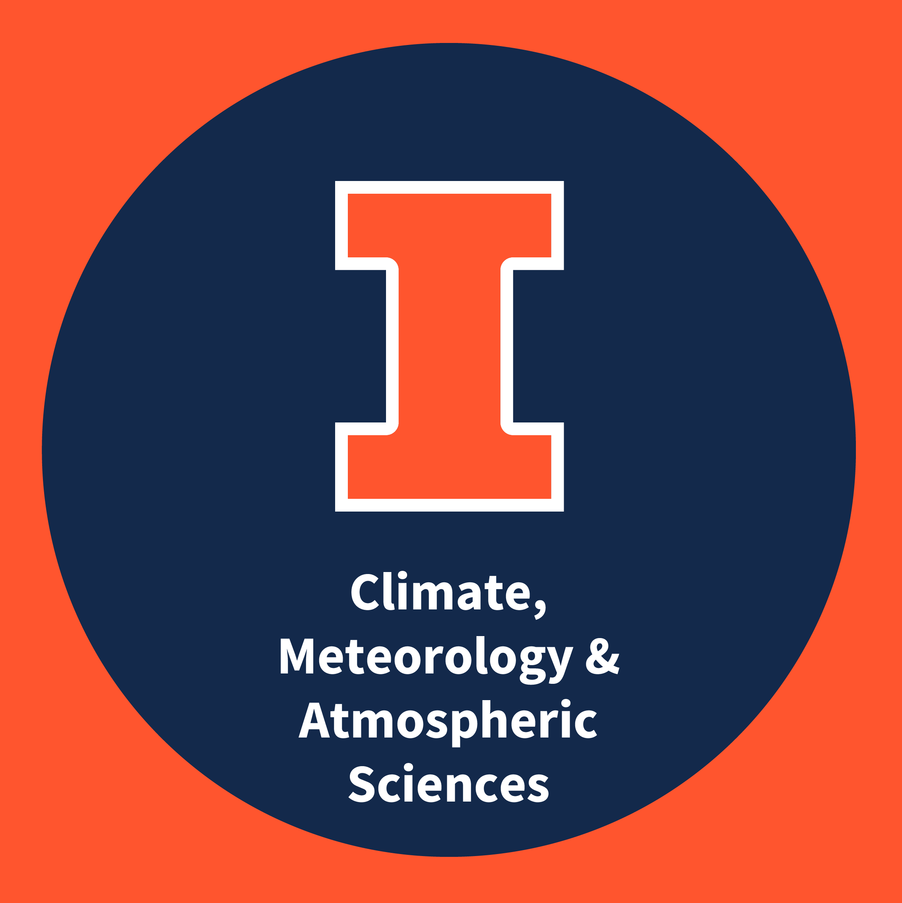
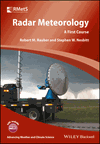

# Steve Nesbitt

**Professor & Department Head**

<a href="https://atmos.illinois.edu">Department of Climate, Meteorology &amp; Atmospheric Sciences</a> (CliMAS), University of Illinois Urbana-Champaign

Joint Appointment, <a href="https://www.anl.gov/evs">Environmental Sciences Division</a>, Argonne National Laboratory

**Associate Dean for Research** *(starting August 16, 2026)*

<a href="https://las.illinois.edu">College of Liberal Arts and Sciences</a>, University of Illinois Urbana-Champaign

---

## About

Steve Nesbitt is a Professor and Department Head in the [Department of Climate, Meteorology & Atmospheric Sciences](https://atmos.illinois.edu) (CliMAS) at the University of Illinois Urbana-Champaign, where he has been a faculty member since 2006. His research focuses on **radar and satellite meteorology, mesoscale convective systems, tropical and subtropical meteorology, cloud microphysics, and data science applied to the water cycle and high-impact weather**. He is recognized for leading major international field campaigns studying cloud dynamics and physics and high-impact weather.

---

## Research Focus Areas

- **Global Precipitation Science** — Satellite and ground-based remote sensing of precipitation across the tropics and subtropics.
- **Convective Storms & Severe Weather** — Dynamics and structure of organized convective systems and their role in severe weather.
- **Radar & Remote Sensing** — Polarimetric radar theory, retrieval algorithms, and open-source radar software.
- **Terrain–Precipitation Coupling** — Orographic effects on convection and precipitation in complex terrain environments.
- **Cloud Microphysics & Snowfall** — Cloud microphysics for improved process understanding and remote sensing retrievals.
- **Urban Hydrometeorology** — Urban effects on precipitation and flooding.
- **Data Science & Machine Learning** — Neural network retrievals, AI-enabled urban climate modeling, radar echo classification, and Python-based open-source tools for weather and climate data analytics.

---

## Textbook

[**Radar Meteorology: A First Course**](https://onlinelibrary.wiley.com/doi/book/10.1002/9781118432662)  
Robert M. Rauber and Stephen W. Nesbitt  
Wiley-Blackwell, 2018 · 488 pp.

*Radar Meteorology: A First Course* is an undergraduate and graduate-level textbook designed for students encountering weather radar for the first time. It covers the physical principles of radar, signal processing, polarimetric observables, precipitation estimation, severe weather applications, and emerging radar technologies. The book is used in ATMS 410 (Radar Meteorology) at the University of Illinois and at universities worldwide. As of 2025, a Chinese translation is also available: [大气科学前沿译丛：雷达气象学导论](https://qxcbs.com/article/23/2421.html).

---

## Selected Honors & Recognition

| Year | Honor |
|------|-------|
| 2025 | Fellow, American Meteorological Society |
| 2025–26 | Fellow, Big Ten Academic Alliance Department Executive Officer Program |
| 2025 | Distinguished Visitor, National University of Córdoba, Argentina |
| 2023 | Distinguished Alumni Award, University of Utah |
| 2023 | Chicago Council Science & Technology Societal Impact Award |
| 2024, 2020, 2015, 2011 | NASA Group Achievement Awards |
| 2021, 2023 | Outstanding Graduate Student Mentor Award, University of Illinois |
| 2015 | NASA Robert H. Goddard Award |
| 2008 | NASA New Investigator Award |

---

## Education

| Degree | Field | Institution | Year |
|--------|-------|-------------|------|
| Ph.D. | Meteorology | University of Utah | 2003 |
| M.S. | Meteorology | Texas A&M University | 1999 |
| B.S. (summa cum laude) | Meteorology | SUNY College at Oswego | 1997 |

---

## Contact

| | |
|---|---|
| **Email** | snesbitt@illinois.edu |
| **Phone** | (217) 244-3740 |
| **Office** | 3074 Natural History Building, 1301 W Green St, Urbana, IL 61801 |
| **Department** | [Climate, Meteorology & Atmospheric Sciences](https://atmos.illinois.edu), University of Illinois |
